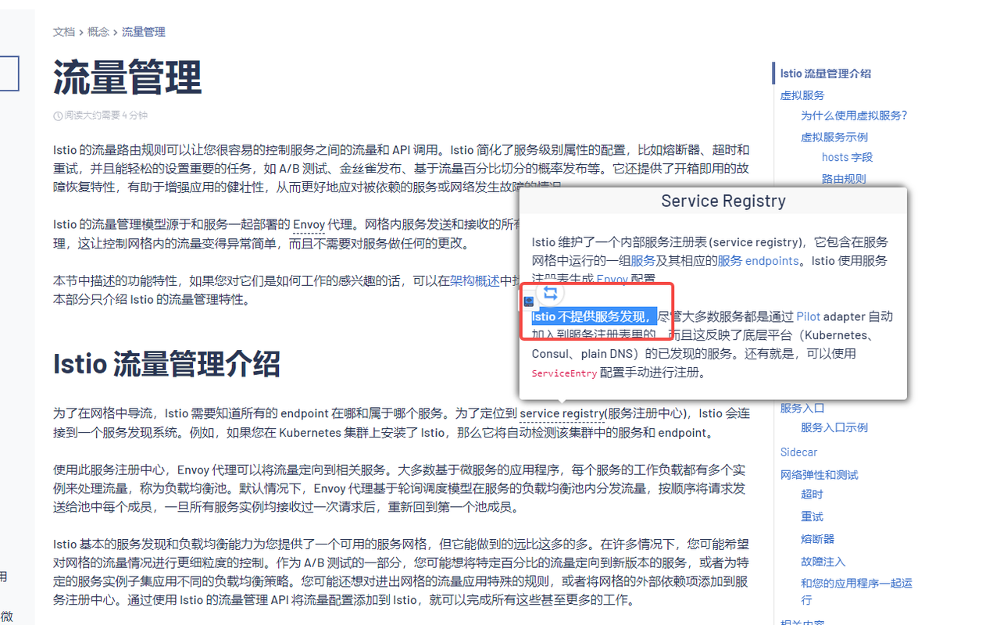
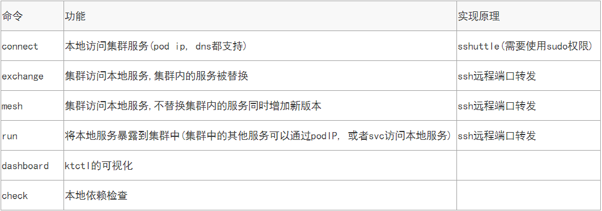
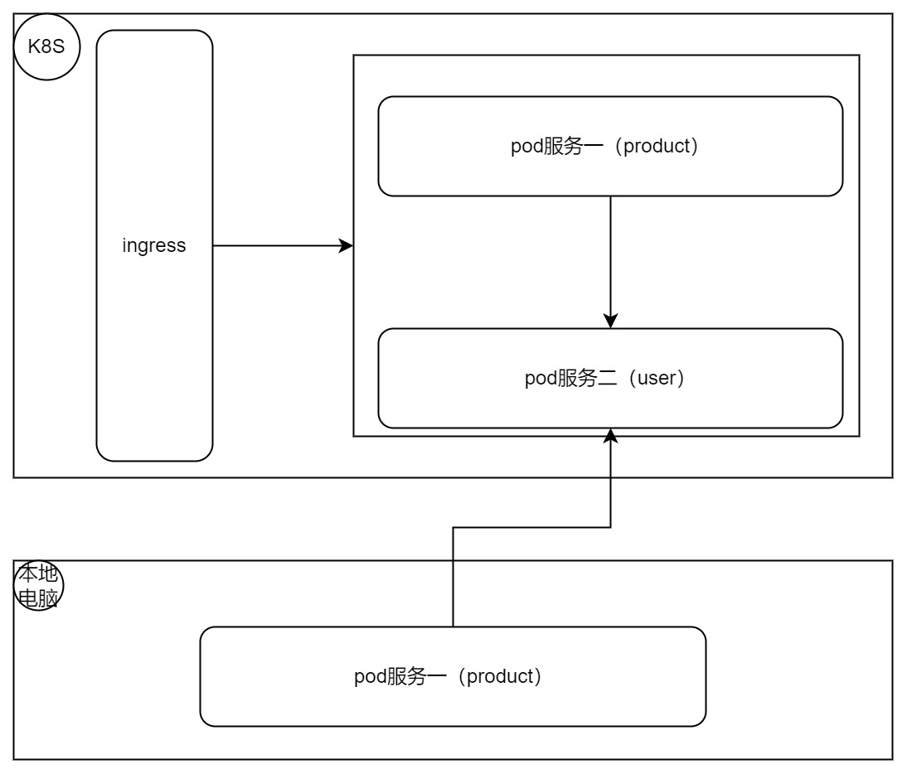

- 由于istio不提供服务发现，注册中心无法对外开放，因此在调试阶段工程师无法安装全部服务在本机操作，肯定违背了微服务架构体系。
- 为此我们引入一个新的工具：kt-connect
- kt-connect是阿里开源的k8s的调试工具，它的作用类似于VPN，能够打通k8s集群和本地的网络。
# 安装kt-connect
- 下载地址：[ktctl下载地址](https://github.com/alibaba/kt-connect/blob/master/docs/zh-cn/guide/downloads.md)
[git 地址](https://github.com/alibaba/kt-connect)
[官网](https://alibaba.github.io/kt-connect/#/)


由于时间原因只完成，connect方案，具体命令如下（sudo权限操作）
```shell
ktctl connect -n istio
```

# demo地址
- 官方提供了bookinfo 代码应用，但是考虑到我们只采用java方式，我在此写了两个demo，脚本。具体流程如下
  
## 服务端调用本地
1. 启动本地的服务
2. 执行 ktctl 命令
```shell
   ktctl mesh <目标服务名> --expose <本地端口>:<目标服务端口>
   ktctl mesh gearistio-user --expose 8081:8080 -n istio
```


3. 在lens上看到自己的服务启动成功
[图片]
红框圈出来的 "fbmuz"就是你的服务的唯一标识，可以使用http请求 header 内增加 VERSION-fbmuz，这样就会由服务端去请求你的本地服务了。
