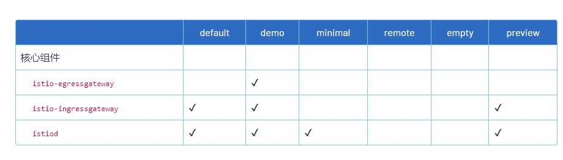
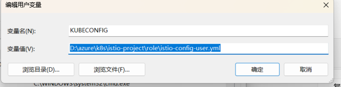

# K8S
- 由于本人采用azure aks方式，因此无需在此部署k8s，如果你要本地部署k8s建议参考一下文档
- [面向云原生应用的容器混合云，支持 Kubernetes 多集群管理的 PaaS 容器云平台解决方案 | KubeSphere](https://kubesphere.com.cn/)
# 安装kubectl命令
- 参考一下文档
- [命令行工具 (kubectl)](https://kubernetes.io/zh-cn/docs/reference/kubectl/)
# istio
- 如果您是技术经理需要关注一下内容，如果您是工程师只需要关注如何使用即可。
# istio安装
- 首先先要确保自身拥有k8s权限，权限首先要有namespace和pods权限。
## istio下载
  [istio下载地址](https://github.com/istio/istio/releases/tag/1.14.2)
1. 下载针对你操作系统的安装文件， 或用自动化工具下载并提取最新版本（Linux 或 macOS）：
   ```shell
      curl -L https://istio.io/downloadIstio | sh -
    ``` 
2. 上面的命令下载最新版本（用数值表示）的 Istio。 你可以给命令行传递变量，用来下载指定的、不同处理器体系的版本。 例如，下载 x86_64 架构的、1.6.8 版本的 Istio ，运行：
   ```shell
        curl -L https://istio.io/downloadIstio | ISTIO_VERSION=1.6.8 TARGET_ARCH=x86_64 sh -
    ``` 
3. 转到 Istio 包目录。例如，如果包是 istio-1.14.2：
   ```shell
      cd istio-1.14.2
   ``` 
4. 安装目录包含：
   - samples/ 目录下的示例应用程序
   - bin/ 目录下的 istioctl 客户端二进制文件 .
5. 将 istioctl 客户端加入搜索路径（Linux or macOS）:
   ```shell
    export PATH=$PWD/bin:$PATH
    ``` 
## istio部署
1. 对于本次安装，我们采用 demo 配置组合。 选择它是因为它包含了一组专为测试准备的功能集合，另外还有用于生产或性能测试的配置组合。
   ()
2. 如果你的平台有供应商提供的配置组合，比如：Openshift，则在下面命令中替换掉 demo 配置项。更多细节请参阅你的 平台说明
   ```
    istioctl install --set profile=demo -y
    Istio core installed
    Istiod installed
    Egress gateways installed
    Ingress gateways installed
    Installation complete
   ```
3. 给命名空间添加标签，指示 Istio 在部署应用的时候，自动注入 Envoy 边车代理：
   ```shell
    kubectl label namespace istio istio-injection=enabled
    ``` 
 ##  账号权限
1. 创建一个角色为 istio-system 命名空间提供读权限。要在下面的步骤中限制参与者的权限，这个角色是必须要有的。
   ```
   kubectl apply -f - <<EOF
   kind: Role
   apiVersion: rbac.authorization.k8s.io/v1beta1
   metadata:
   name: istio-system-access
   namespace: istio-system
   rules:
   - apiGroups: ["", "extensions", "apps"]
     resources: ["*"]
     verbs: ["get", "list"]
     EOF
      ```
1. 为每个参与者创建服务账号：
   ```shell
    kubectl apply -f - <<EOF
    apiVersion: v1
    kind: ServiceAccount
    metadata:
      name: ${NAMESPACE}-user
      namespace: $NAMESPACE
    EOF
   ``` 
3. 限制每个参与者的权限。在教程中，参与者只需要在他们自己的命名空间中创建资源以及从 istio-system 命名空间中读取资源。 即使使用您自己的集群，这也是一个好的实践，它可以避免影响您集群中的其他命名空间。
4. 创建一个角色为每个参与者的命名空间提供读写权限。为每个参与者赋予这个角色，以及读取 istio-system 资源的角色：
   ```shell
    kubectl apply -f - <<EOF
    kind: Role
    apiVersion: rbac.authorization.k8s.io/v1beta1
    metadata:
    name: ${NAMESPACE}-access
    namespace: $NAMESPACE
    rules:
    - apiGroups: ["", "extensions", "apps", "networking.k8s.io", "networking.istio.io", "authentication.istio.io",
      "rbac.istio.io", "config.istio.io"]
      resources: ["*"]
      verbs: ["*"]
    ---
    kind: RoleBinding
    apiVersion: rbac.authorization.k8s.io/v1beta1
    metadata:
    name: ${NAMESPACE}-access
    namespace: $NAMESPACE
    subjects:
    - kind: ServiceAccount
      name: ${NAMESPACE}-user
      namespace: $NAMESPACE
      roleRef:
      apiGroup: rbac.authorization.k8s.io
      kind: Role
       ```


# 本地电脑
在本模块中，您将为教程准备本地计算机
1. 安装 curl。
2. 安装 Docker。
3. 安装 kubectl。
4. 为您从教程中收到的配置文件或者在上一个模块自己创建的配置文件设置环境变量 KUBECONFIG。
   ```shell
      export KUBECONFIG=路径/istio-config-user.yml
   ``` 
5. 如果你是windows请添加环境变量
   
6. 通过打印当前命名空间来验证配置是否生效：
   ```shell
   kubectl config view -o jsonpath="{.contexts[?(@.name==\"$(kubectl config current-context)\")].context.namespace}"
   tutorial
   ```
7. 您应该在输出中看到命名空间的名称，该命名空间由讲师分配或者在上一个模块中由您自己分配。
8. 下载一个 Istio 发行版 ，从 bin 目录下提出命令行工具 istioctl，使用下边的命令验证 istioctl 是否可以正常使用：
   ```
   istioctl version
   client version: 1.7.0
   control plane version: 1.7.0
   data plane version: 1.7.0 (4 proxies)
   ```
   恭喜，您已配置完毕本地计算机！

# istio+本地调试开发
[传送门](istio.md)